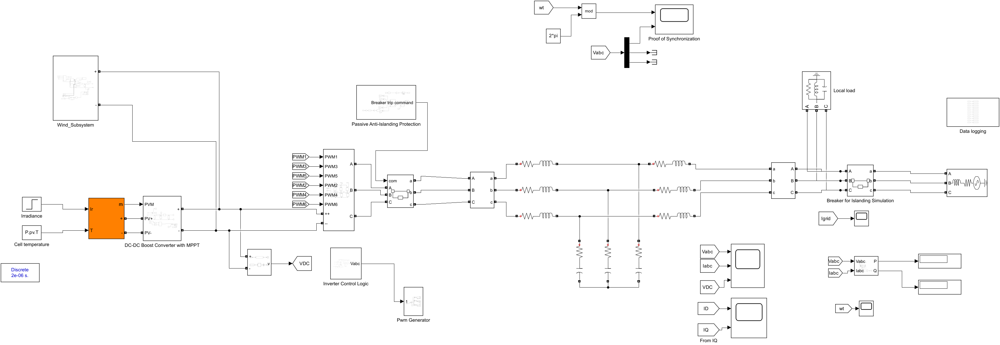
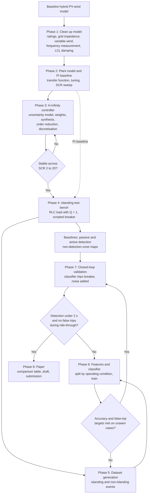

# hybrid-pv-wind-islanding-detection

Ride-through-compatible islanding detection for a grid-connected hybrid solar PV–wind system, using a machine-learning classifier on top of an H-infinity current controller. MATLAB/Simulink.

> **Status:** work in progress. The baseline Simulink models exist; phases 1–7 below are planned and have no results yet.

## Problem

IEEE 1547-2018 asks an inverter-based source to do two things that pull against each other:

- stay connected through voltage sags and frequency swings (ride-through), and
- detect a real island and stop energising it within 2 seconds.

Passive detection (voltage, frequency, rate of change of frequency) has a non-detection zone when local load and generation are nearly matched, and it false-trips on ordinary disturbances. Active methods shrink that zone but inject disturbances and degrade power quality. Both problems get worse on a weak grid.

## Proposed approach

1. An **H-infinity current controller** keeps the inverter stable and well-damped across a range of grid strengths, so the test bed behaves properly on a weak grid.
2. A **machine-learning classifier** separates islanding from non-islanding disturbances using features measured at the point of common coupling.
3. Both are compared against PI control and against passive and active detection on the same test cases.

## System under study

| Item | Value |
|---|---|
| PV | Array with boost converter and P&O MPPT |
| Wind | PMSG with rectifier and boost converter |
| DC link | 800 V |
| Inverter | Three-phase two-level VSI, 10 kHz switching |
| Filter | LCL |
| Grid | 400 V, 50 Hz |

Ratings will be fixed and documented in phase 1 (the current model and the thesis disagree on the PV rating).

## Model

`hybrid_pv_wind_islanding.slx` is the corrected test bed (PI control and a passive detector; the H-infinity controller and ML detector come in later phases).



| Subsystem | Diagram |
|---|---|
| Wind turbine, PMSG, rectifier, boost and optimal-torque MPPT | [wind_subsystem.png](docs/wind_subsystem.png) |
| PV boost converter with perturb-and-observe MPPT | [pv_boost_mppt.png](docs/pv_boost_mppt.png) |
| Inverter control: PLL, DC-link and current loops | [inverter_control.png](docs/inverter_control.png) |
| Passive protection: voltage, frequency and rate of change of frequency | [passive_protection.png](docs/passive_protection.png) |

Regenerate the pictures with `export_diagrams` after any model change.

## Workflow



### Phase 1 — Clean up the baseline model
- Fix one rating for PV and wind and use it everywhere.
- Replace the near-ideal grid source with a realistic impedance, parameterised by short-circuit ratio (SCR).
- Add a variable wind-speed profile and wind-side MPPT to the hybrid model.
- Correct the frequency measurement (take it from the PLL; the gain must be `1/(2*pi)`).
- Redesign the LCL damping resistor to match the design equation.
- Output: one parameter script, `scripts/params.m`, that every model reads.

### Phase 2 — Plant model and PI baseline
- Derive the transfer function of inverter + LCL filter + grid impedance.
- Tune the PI current controller properly and record its margins.
- Sweep SCR (20, 10, 5, 3, 2) and record where PI degrades.
- Output: Bode plots, stability limits, baseline distortion and DC-link response.

### Phase 3 — H-infinity controller
- Model grid inductance as an uncertain parameter over the SCR range.
- Choose weighting functions for tracking, control effort and robustness, and document the reasoning.
- Synthesise with the Robust Control Toolbox (`mixsyn` or `ncfsyn`; `musyn` for structured uncertainty).
- Reduce the controller order and discretise at the switching rate.
- Output: PI vs H-infinity on the same SCR sweep — stability margins, settling time, overshoot, current distortion.

### Phase 4 — Islanding test bench
- Add a parallel RLC load at the point of common coupling, tuned to 50 Hz with quality factor 1 (IEEE 1547.1 unintentional-islanding test).
- Script the grid breaker to open during the run.
- Implement two baselines: passive (over/under voltage, over/under frequency, rate of change of frequency) and one active method (frequency shift or reactive-power perturbation).
- Sweep active and reactive power mismatch and map the non-detection zone of each baseline.
- Output: non-detection-zone maps and detection times for the baselines.

### Phase 5 — Dataset generation
- Islanding cases: the mismatch sweep, at several PV/wind power shares and SCR values.
- Non-islanding cases: sags, swells, faults, load switching, capacitor switching, irradiance steps, wind steps, frequency excursions.
- Automate with a batch script (`parsim`), logging voltage and current at the point of common coupling with a label and event time.
- Output: labelled raw signals in `data/raw/`.

### Phase 6 — Features and classifier
- Extract features over a short sliding window: voltage magnitude, frequency, rate of change of frequency, phase jump, rate of change of power, current and voltage distortion, negative-sequence voltage.
- Split by operating condition, not by random sample, so the test set contains unseen conditions.
- Train a random forest and an SVM first, then a small neural network; keep the simplest model that meets the targets.
- Output: trained model, confusion matrix, feature importance.

### Phase 7 — Closed-loop validation
- Put the trained classifier back into Simulink so it trips the breaker itself.
- Re-run the full test set with measurement noise added.
- Report, for the proposed method and both baselines:
  - detection time against the 2-second limit,
  - non-detection zone,
  - false-trip rate during ride-through events,
  - effect on current distortion.
- Repeat with PI and with H-infinity control to show what the controller contributes.

### Phase 8 — Paper
- Comparison table against recent published methods.
- Draft, internal review by supervisors, submission.

## Repository layout

```
hybrid_pv_wind_islanding.slx   Corrected test-bed model (R2024b), built by scripts/build_model.m
MATLAB_R2018a/                 Original Simulink models, saved in R2018a (kept unchanged)
scripts/params.m               Every rating, gain and test setting in one place
scripts/build_model.m          Rebuilds the corrected model from the original, change by change
scripts/run_model.m            Runs the model and reports power, DC link, frequency, distortion, trip
scripts/run_baseline.m         Runs the original model for the before/after comparison
scripts/export_diagrams.m      Saves the model diagrams to docs/
docs/                          Model diagrams
results/                       Simulation outputs, not tracked in git
data/, ml/, paper/             Planned
report/, archive/              Kept locally, not tracked
```

To run an islanding case:

```matlab
addpath scripts
P = params(10);            % short-circuit ratio 10
P.tIsland = 0.5;           % open the grid breaker at 0.5 s
P.load.P = 18.4e3; P.load.QL = P.load.P; P.load.QC = P.load.P;   % matched RLC load, Qf = 1
run_model(1.0, P, 'island_matched');
```

## Requirements

- MATLAB with Simulink and Simscape Electrical (Specialized Power Systems)
- Robust Control Toolbox
- Statistics and Machine Learning Toolbox
- Parallel Computing Toolbox (optional, for batch runs)

## Authors

To be confirmed with the project team and supervisors.
